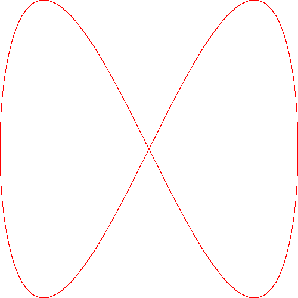
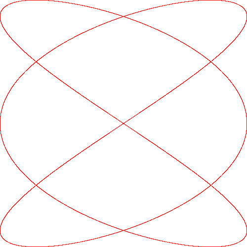
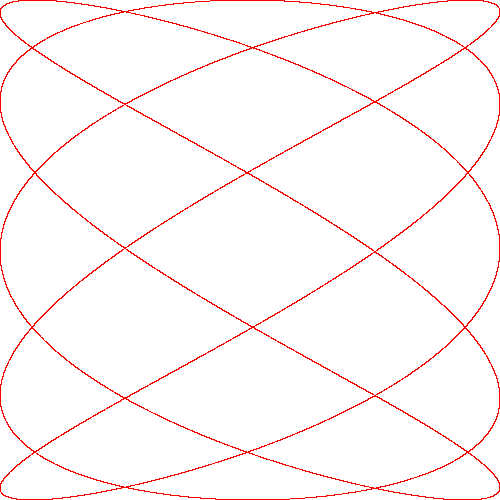

# arko-project-2
Lissajous curve implementation in x86 assembly

## Preview

    
     
    

## Prerequisites
User interface implemented using [Simple DirectMedia Layer](https://www.libsdl.org/). Application compiled with [MinGW](http://www.mingw.org/) and tested on Windows 10. <b>Warning:</b> `Makefile` is configured for Windows only. Manual reconfiguration may be required for your machine.

## References
- Wikipedia Contributors. "Lissajous curve." <i>Wikipedia</i>. 2019. [[link]](https://en.wikipedia.org/wiki/Lissajous_curve)
- Félix Cloutier. "x86 and amd64 instruction reference." 2019. [[link]](https://www.felixcloutier.com/x86/index.html)
- Ed Jorgensen. "x86-64 Assembly Language Programming with Ubuntu". <i>University of Nevada, Las Vegas</i>. 2019. [[link]](http://www.egr.unlv.edu/~ed/assembly64.pdf)
- "Handling the Keyboard." <i>Simple DirectMedia Layer</i>. 2019. [[link]](https://www.libsdl.org/release/SDL-1.2.15/docs/html/guideinputkeyboard.html)
- "How to draw pixels in SDL 2.0?" <i>Stack Overflow</i>. 2013. [[link]](https://stackoverflow.com/questions/20579658/how-to-draw-pixels-in-sdl-2-0)
